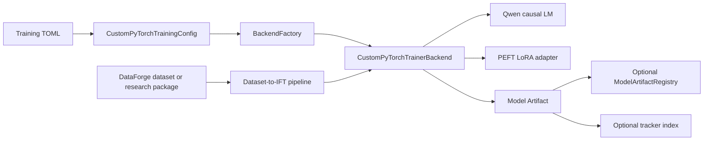

# Architecture

Common contracts and backend selection live in `cognityx-core`. Transformers,
PEFT, BitsAndBytes, CUDA, and Qwen-specific configuration stay in this package.
The tracker interface is a sidecar: it logs identities, scalar measurements and
Storage URI/checksum references but never copies adapter or prediction files.
