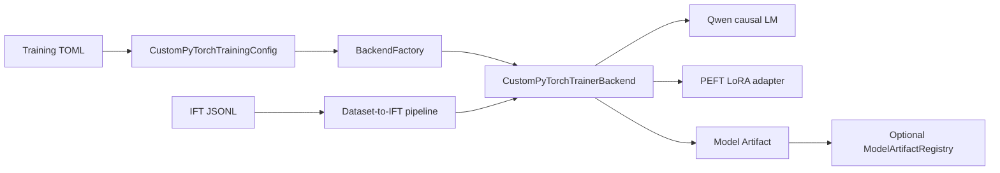

# Architecture

```mermaid
flowchart LR
    TOML[Training TOML] --> Config[CustomPyTorchTrainingConfig]
    Config --> Factory[BackendFactory]
    Factory --> Backend[CustomPyTorchTrainerBackend]
    JSONL[IFT JSONL] --> Pipeline[Dataset-to-IFT pipeline]
    Pipeline --> Backend
    Backend --> Qwen[Qwen causal LM]
    Backend --> PEFT[PEFT LoRA adapter]
    Backend --> Artifact[Model Artifact]
    Artifact --> Registry[Optional ModelArtifactRegistry]
```

Common contracts and backend selection live in `cognityx-core`. Transformers,
PEFT, BitsAndBytes, CUDA, and Qwen-specific configuration stay in this package.
